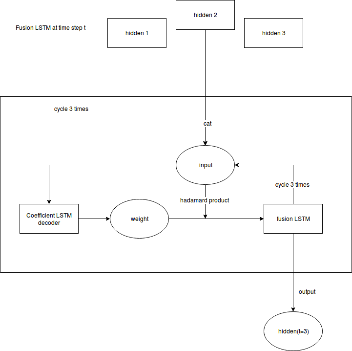
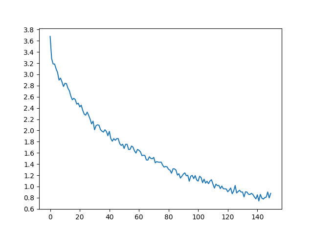

# Fusion LSTM exercise (version 2, with Coefficient LSTM added)

This is just a toy example in which we perform fusion of multiple LSTMs at each time step of the unfolding of an LSTM. This example is about French-to-English translation.

The dataset and the basic archetecture are adapted from: <br>
http://pytorch.org/tutorials/intermediate/seq2seq_translation_tutorial.html

# General Architecture
See model.py for details of the network architecture. The architecture of the network looks like: <br>


At the i-th time step (in this case, at the i-th word in a array of word, i. e. a sentence), the FusionLSTM takes in the hidden states of three different LSTM encoders, and outputs the fusion_state, i. e. fusion_state = FusionLSTM(hidden_1, hidden_2, hidden_3 ), and the encoders each takes in the input, its own hidden state, and the fusion_state, and outputs an encoding of the sentence, which is then decoded by a GRU decoder.

# Fusion with Coefficient LSTM
The Fusion LSTM is the core of this architecture, it involves the interaction of an LSTM fuser (see class fusionLSTM in model.py) and a coeffiecient LSTM (see WeightLSTM in model.py) that weights the fused states of the fuser, the fusion LSTM has the following complicated structure:


At each step, the coeffiencient takes in its hidden state and its last output (which is initialized to a vector with value 1 / Fusion_Size, i.e. a uniform weight), and the output is a weight vector computed by taking the softmax of its the hidden state (thus converting it to a distribution). We use the weight vector to weight the hidden states and use this as the input to the fusion LSTM, and cycle this for three steps (since more layers of LSTMs tend to give better result but are slow to train).

# Parameters and Results
In this example, all three encoders have the same architecture except that they respectively have hidden state size 256, 64, 16, and so fusion_size = 256 + 64 +16. The learnign rate is 0.01 with momentum 0.2 (I experimented with momentum 0.2, 0.5, and 0.9, and 0.2 seems to render the fastest and more stable convergence). I was sort of expecting that having different hidden-sizes might make the encoders learn to encode features of a sentence at different length scales, but in practice I find it extremely hard and slow to train.

After 5.5 epochs, the loss looks like this. It converges at the same speed as normal RNN decoder and encoder with respect to the sample size, but it takes about 3 times longer to train:


Some sample translation (> denotes the original French sentence, = denotes the target, < denotes the translated English). This is the output at epoch 5.5:
```
> nous sommes toutes en train d etre manipulees .
= we re all being manipulated .
< we re all being manipulated . <EOS>

> vous etes tellement previsibles !
= you re so predictable .
< you re so sweet . <EOS>

> je me rejouis que vous n ayez pas ete blessees .
= i m glad you weren t injured .
< i m glad you weren t injured . <EOS>

> c est un bon a rien .
= he is good for nothing .
< he is good for nothing . <EOS>

> tu preches un convaincu .
= you re preaching to the choir .
< you re preaching to the choir . <EOS>

> je suis ravi que vous ayez souleve ca .
= i m glad you brought that up .
< i m glad you brought that up . <EOS>

> il a tendance a se mettre en colere .
= he is inclined to get mad .
< he s in to . . <EOS>
```

For comparison, this is its ouput at epoch 0.5:

```
> je suis heureux de vous avoir rencontre .
= i m very happy to make your acquaintance .
< i m glad you to help you . . <EOS>

> en chemin elle a vu beaucoup d animaux .
= she saw many animals on the way .
< she is no as as as as i am . <EOS>

> tu arrives trop tard .
= you are too late .
< you re all to . . . <EOS>

> je vais faire quelque chose par moi meme pendant un moment .
= i m going to do something by myself for a while .
< i m going to as a a a . . . <EOS>

> vous etes un horrible individu .
= you re a terrible person .
< you re all a . . <EOS>

```
# To Do
-This is a very tentative version, and the code is far from being polished. So I guess I need to polish the code <br>
-In the current implementation, the fusion_state is passed in alongside the input word (i.e. cat(input, fusion_state)) into a general LSTM, a better version should probably implement a customized LSTM, and do some separate operation on the fusion_state
